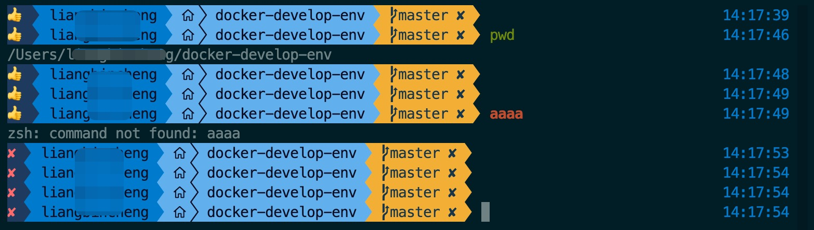
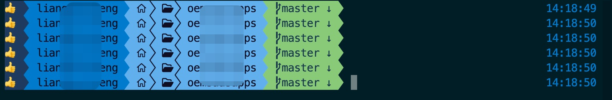

# 🚀 终端美化与增强配置指南

本文档记录在 macOS 上使用 `zsh` + `oh-my-posh` + `fzf-tab` 等工具打造高效、美观终端环境的完整配置流程。适用于希望快速复现该开发环境的用户。

> 💡 **适用系统**：macOS（通过 Homebrew 管理）

---


---

## ✅ 配置步骤

### 1. 安装 `oh-my-posh`

```bash
brew install jandedobbeleer/oh-my-posh/oh-my-posh
```

### 2. 配置 Oh My Posh 主题

```bash
mkdir -p ~/.poshthemes
```

#### 将本仓库中的 [agnosterplus.omp.json](agnosterplus.omp.json)文件内容复制到本地：

```text
~/.poshthemes/agnosterplus.omp.json
```

### 3. 安装 Meslo Nerd Font（推荐字体）

```bash
brew install --cask font-meslo-lg-nerd-font
```

##### ⚠️ 安装完成后，请在终端设置中将字体切换为 MesloLGL Nerd Font，否则图标无法正常显示。

### 4. 安装并初始化 `fzf`（模糊搜索工具）

```bash
brew install fzf
$(brew --prefix)/opt/fzf/install
```

##### 按提示启用 shell 扩展（建议全选），以支持历史命令搜索和文件补全。

### 5. 创建插件目录

```bash
mkdir -p ~/.plugin.zsh
```

### 6. 安装 `fzf-tab` 插件

```bash
git clone https://github.com/Aloxaf/fzf-tab ~/.plugin.zsh/fzf-tab
```

### 7. 安装 `fast-syntax-highlighting` 高亮插件

```bash
git clone https://github.com/zdharma-continuum/fast-syntax-highlighting.git ~/.plugin.zsh/fast-syntax-highlighting
```

### 8. 安装 [common-aliases](https://github.com/ohmyzsh/ohmyzsh/blob/master/plugins/common-aliases/common-aliases.plugin.zsh) 插件

```bash
mkdir -p ~/.plugin.zsh/common-aliases
curl -fsSL https://raw.githubusercontent.com/ohmyzsh/ohmyzsh/master/plugins/common-aliases/common-aliases.plugin.zsh -o ~/.plugin.zsh/common-aliases/common-aliases.plugin.zsh
```

### 9. 配置 ~/.zshrc

##### 使用本仓库中的 [.zshrc](.zshrc) 文件内容覆盖到你本地配置文件的首行：

```text
vim ~/.zshrc
```